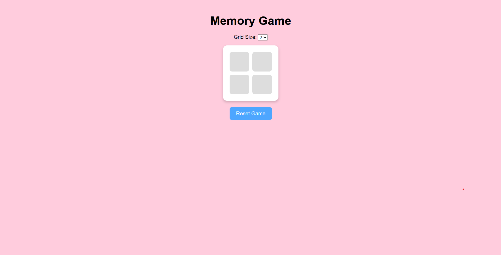

# Memory Game

A fun card-matching game where players flip cards to find matching pairs against a timer.

## About

This is a browser-based memory game built using HTML, CSS, and JavaScript.  
The game displays a set of cards facedown, and players flip two cards at a time to find matching pairs.  
I built this project to practice DOM manipulation, event handling, and game logic in JavaScript.

## Built With

`HTML` `CSS` `JavaScript`

## What I Learned

- How to implement game logic, handle click events, and update the UI dynamically while tracking game state (matches, moves, timer).

## Links

- [Live Demo](https://snehashrestha123.github.io/Memory-Game/)
- [Source Code](https://github.com/Snehashrestha123/Memory-Game)
